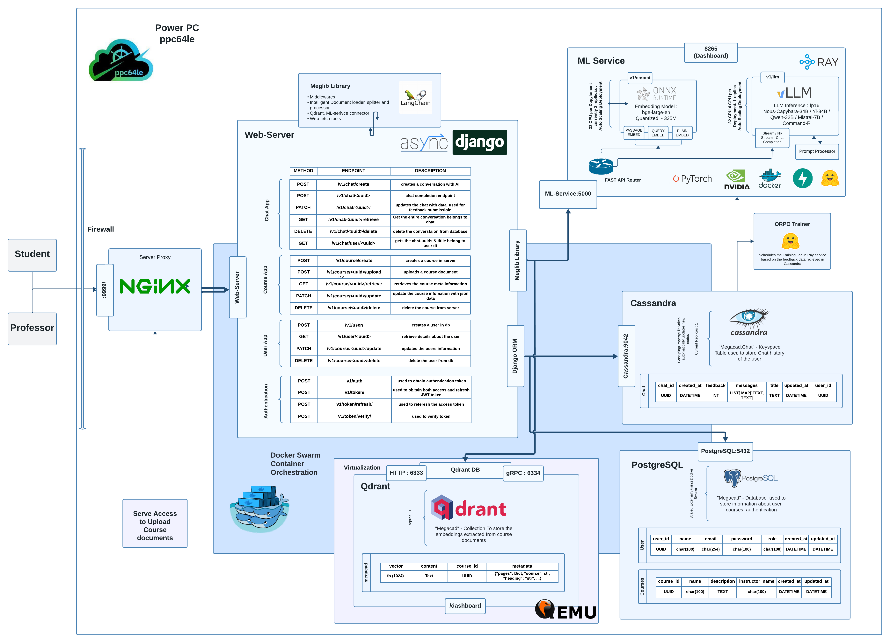

# AI-Learning Platform

The system depicted in the image is a multi-component architecture designed to handle various tasks efficiently. Here's a brief explanation of its usage and how it works:

1. **Power PC Prototype (ppc64le)**: This is likely the main processing unit of the system. It's responsible for executing instructions and carrying out operations.

2. **Web Server (Django)**: Django is a high-level Python web framework that encourages rapid development and clean, pragmatic design. It's used for building web applications quickly and with less code.

3. **ML Services**: This part of the system is dedicated to running LLM Models and the embedding models. This works as the Brain of the AI-Learning Platform

4. **Databases (Cassandra, PostgreSQL and QdrantDB)**: These are used for storing and retrieving data. Cassandra is designed to handle large amounts of data across many commodity servers, providing high availability with no single point of failure. PostgreSQL is a powerful, open-source object-relational database system. QdrantDB stores the emebeddings of the text documents which will be picked by the RAG pipeline during inference

6. **Docker Swarm**: This is a container orchestration tool, meaning it allows the user to manage multiple containers deployed across multiple host machines.

Overall, this system is designed to handle complex tasks, manage large amounts of data, and provide high availability and scalability. It's a versatile setup that can be used in various fields, such as web development, data science, and machine learning. The exact usage would depend on the specific requirements of the project or organization it's being used in. For example, a tech company might use this system to power their web services, run data analyses, and store user data.